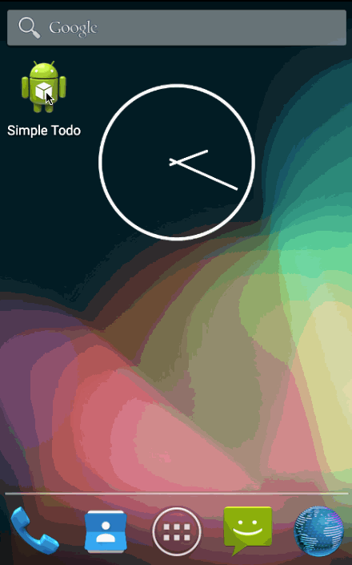

# Simple Todo Application

This is an Android application for creating and managing a simple todo list, as pre-work requirement for [CodePath Android bootcamp](http://www.codepath.com/).

Time spent: 4 hours spent in total

Completed user stories:

 * [x] Required: Add new item to the list  by using text field and a button.
 * [x] Required: Remove item from the list by long clicking on the the item.
 * [x] Required: Save item list on local folder on every change on the list.
 * [x] Required: Load the saved item list on application start and populate list.
 * [x] Required: Edit item in the list by short clicking on the item using a new activity with a textfield and a button. 

Notes:
 1. However the “Developer Options/Apps/Don’t keep activities” is checked, the debugger still kept the activities. Good example is while having the Edit Item activity running press the home button, then starting the app again the Edit Item activity comes back.  For this reason the gif file below with user stories does not include the Save/Load items on Stop/Start of the app.  Tested on an actual device, Nexus 7, and works fine on it.
 2. The walk-through slides say use Minimum SDK API 16 during setup, but later after the walkthrough the website says API 14 should be used. The app currently uses API 16.
 3. FocusRequest for the textfield on the Edit Item activity does not bring up the keyboard, but it is in focus (meaning works fine in debugger when you use actual pc keyboard).
 
Walkthrough of all user stories (except Start/Stop app):

GIF created with [LiceCap](http://www.cockos.com/licecap/).

